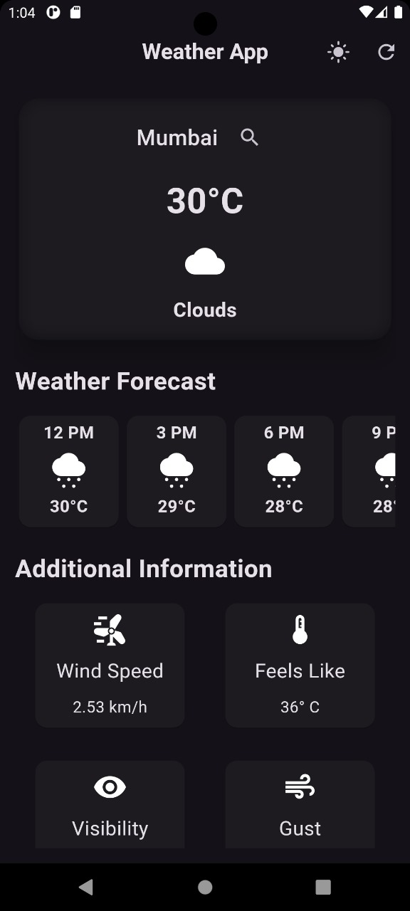
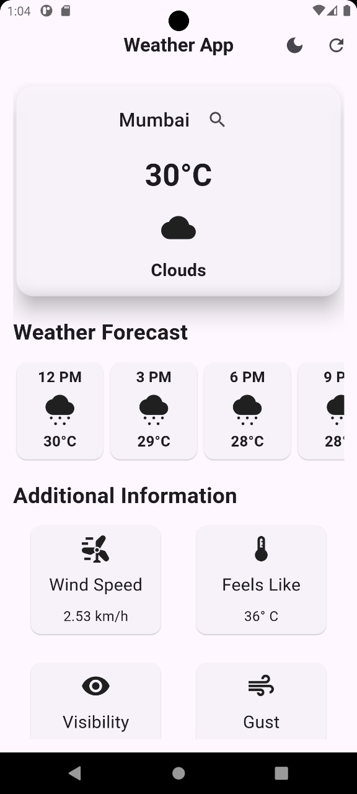
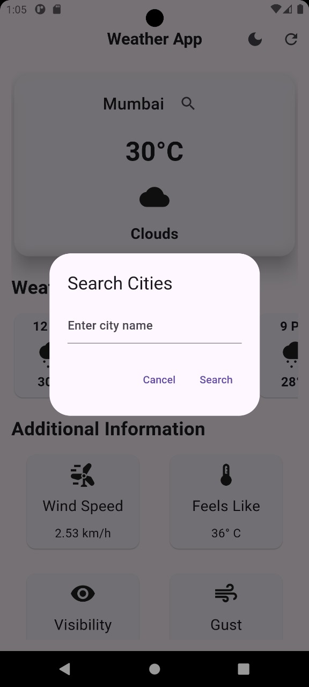
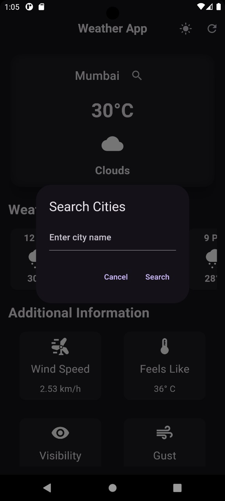
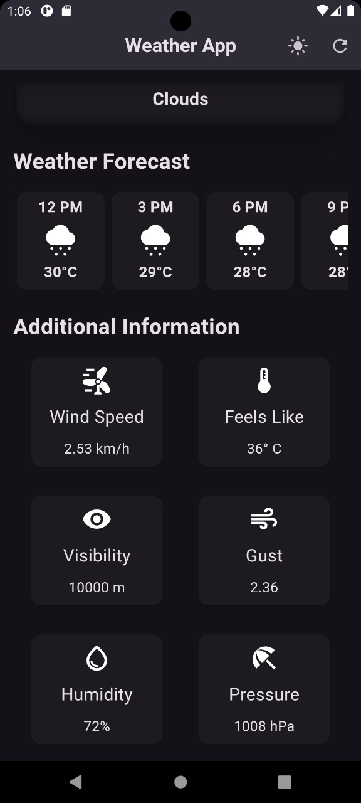
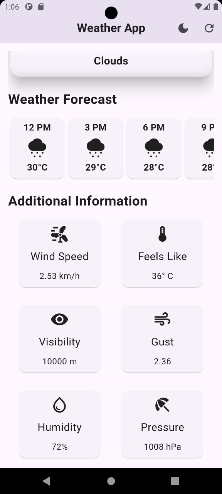

# 🌦️ Weather App
A Flutter-based mobile weather app with real-time forecasts and customizable themes.

## Features
- Current weather with temperature and weather condition icons
- Weather forecast for the next hours
- Additional weather information like wind speed, humidity, visibility, and pressure
- Search for weather in different cities
- Theme toggle between light and dark modes
- Auto-refresh and manual refresh features

## Screenshots

<table>
  <tr>
    <td></td>
    <td></td>
    <td></td>
    <td></td>
    <td></td>
    <td></td>
  </tr>
</table>

## Experience the App

You can access the app here:

**[Weather App - Download and Use Here](https://weather-app-zeta-seven-65.vercel.app/)**

> **Note:** This app is primarily designed for mobile devices. For the best experience, please use the app on a mobile phone.

## How to Use
1. Open the app on your mobile phone by visiting the link above.
2. Use the search icon to find weather information for different cities.
3. Toggle between light and dark modes using the theme toggle button in the app.

## Prerequisites
- Flutter SDK installed on your machine. You can install it [here](https://flutter.dev/docs/get-started/install).


## How to Run Locally

1. Clone the repository:
   ```bash
   git clone https://github.com/your-repo/weather-app.git
2. Navigate to the project directory:
   ```bash
   cd weather-app
3. Install dependencies:
   ```bash
   flutter pub get
4. Run the app:
   ```bash
   flutter run

## API Key
To run the app locally, you need to add your own OpenWeatherMap API key:
1. Create a lib/secrets.dart file::
   ```bash
   const String openWeatherAPIKEY = "YOUR_API_KEY";

2.Add your API key and make sure to not share it publicly.
  
3. Ensure that secrets.dart is added to .gitignore to keep your API key safe:
   ```bash
   lib/secrets.dart

## Acknowledgements
- This app uses the OpenWeatherMap API for fetching weather data.
- Thank you to the Flutter community for their support and resources.


### Additional Notes
- Make sure to replace `https://github.com/your-repo/weather-app.git` with the actual URL of your GitHub repository.
- Adjust any sections to better fit your specific project details or preferences.
